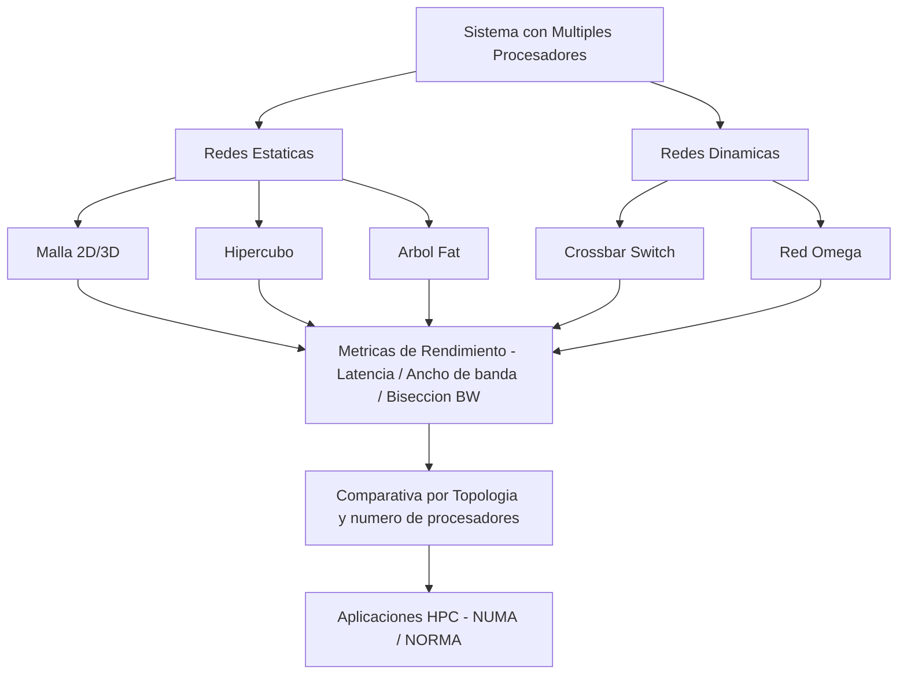

# Redes de Comunicación de Sistemas con Múltiples Procesadores

> Análisis de redes de comunicación en arquitecturas de cómputo paralelo con múltiples procesadores.

## Descripción

---

Estudio de las topologías de interconexión empleadas en sistemas de procesamiento paralelo: redes estáticas (malla, hipercubo, árbol) y dinámicas (crossbar, omega), protocolos de comunicación entre procesadores, latencia, ancho de banda y métricas de rendimiento en arquitecturas HPC.

## Contenido

| Archivo | Descripción |
|---|---|
| `*.pdf` | Informe técnico del análisis de redes de interconexión |
| `*.docx` | Desarrollo completo del trabajo académico |

## Temas cubiertos

- Topologías de interconexión: bus, malla 2D/3D, hipercubo, árbol fat
- Protocolos de paso de mensajes: latencia, ancho de banda, bisección BW
- Comparativa de rendimiento según topología y número de procesadores
- Aplicaciones en sistemas HPC y arquitecturas NUMA/NORMA

## Contexto académico

**Asignatura:** Redes de Computadores · **Institución:** Ingeniería Informática
**Autor:** Alejandro De Mendoza — Ingeniero Informático · Máster Arquitectura de Software

---

## Arquitectura

## Autor

**Alejandro De Mendoza**  
Ingeniero Informático · Especialista en IA · Especialista en Ingeniería de Software · Máster en Arquitectura de Software

